# Lab 4: Different Types of IoT Sensors

## 1. Title : **Different Types of IoT Sensors**

## 2. Objectives
- Understand the concept and importance of IoT sensors.
- Identify and classify different types of IoT sensors.
- Study the basic functions of commonly used sensors in IoT systems.
- Learn how sensors are categorized based on physical parameters.
- Understand real-world applications of different IoT sensors.

## 3. Introduction
The **Internet of Things (IoT)** is a system of interconnected physical devices that communicate and exchange data over the internet. These devices rely heavily on **sensors** to interact with the physical environment.

Sensors act as the **"eyes and ears"** of IoT systems by detecting environmental changes and converting them into electrical signals. These signals are then processed to enable monitoring, automation, and intelligent decision-making.

## 4. Background Theory

### 4.1 Introduction to IoT Sensors
IoT sensors are electronic devices that detect changes in physical conditions such as temperature, humidity, light, motion, gas levels, and pressure. They convert these physical changes into measurable electrical signals.

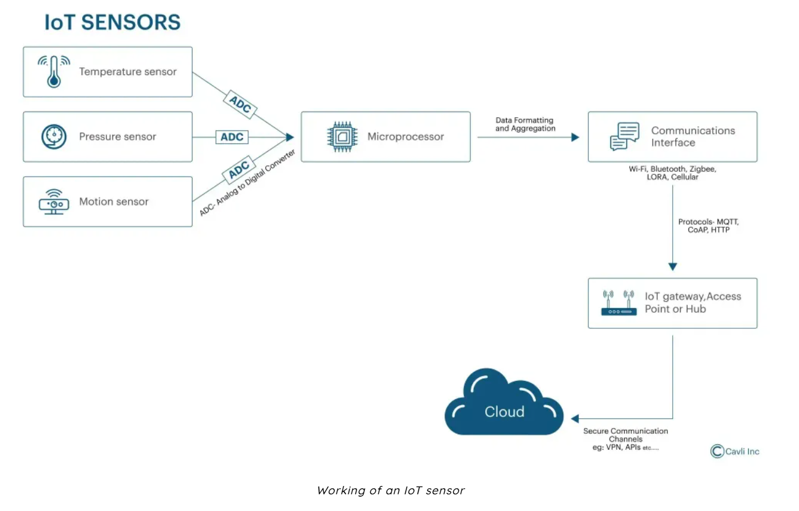

**Basic Data Flow:**  
Physical Environment → Sensor → Microcontroller → Cloud/Application

### 4.2 Classification of IoT Sensors

#### A. Based on Physical Parameter Measured
- **Temperature Sensors** (LM35, DHT11)
- **Humidity Sensors**
- **Pressure Sensors** (BMP180)
- **Light Sensors** (LDR, Photodiode)
- **Motion Sensors** (PIR Sensor)
- **Gas Sensors** (MQ Series)

#### B. Based on Function
- Environmental Sensors (Temperature, Humidity, Air Quality)
- Motion Detection Sensors (PIR, Ultrasonic)
- Position Sensors (GPS, Accelerometer)
- Optical Sensors (Light, Infrared)

## 5. Types of IoT Sensors

### 5.1 Temperature Sensors
Temperature sensors measure heat levels in an environment. They are widely used in weather monitoring, industrial systems, and smart homes.

**Examples:** LM35, DHT11

**Applications:**
- HVAC Systems
- Weather Stations
- Industrial Monitoring

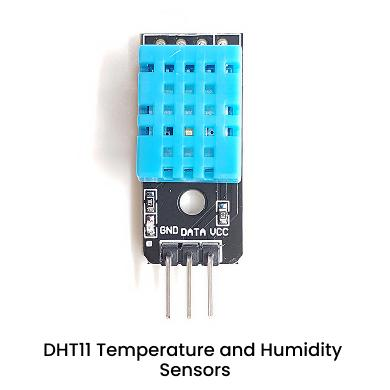

### 5.2 Humidity Sensors
Humidity sensors measure moisture content in the air. They are used in agriculture, weather forecasting, and environmental monitoring systems.

**Applications:**
- Smart Farming
- Greenhouses
- Weather Monitoring

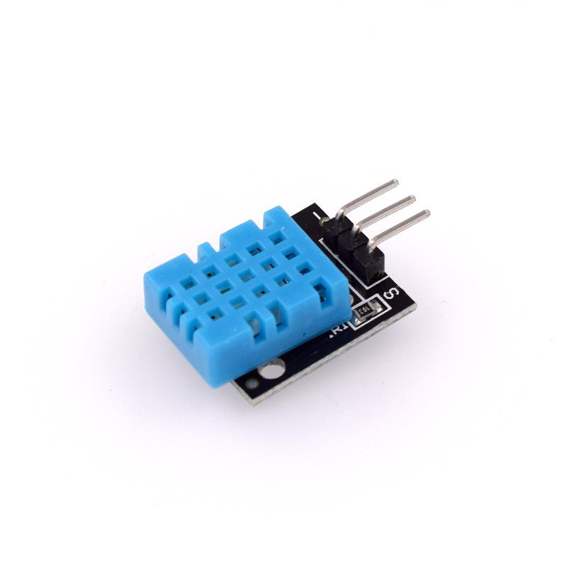

### 5.3 Light Sensors
Light sensors detect the intensity of light in the surroundings. They are used in automatic street lights, smartphone brightness control, and energy-saving systems.

**Example:** LDR (Light Dependent Resistor)

**Applications:**
- Automatic Lighting Systems
- Smartphone Brightness Control
- Energy Saving Systems

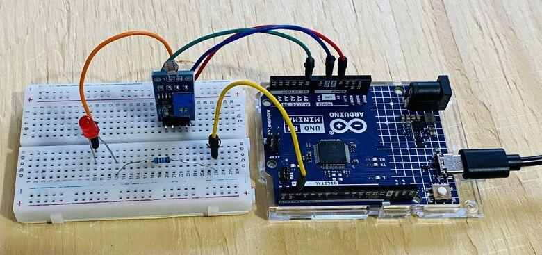

### 5.4 Motion Sensors
Motion sensors detect movement of objects or humans within a defined area. They are widely used in security systems and automatic doors.

**Example:** PIR Sensor

**Applications:**
- Smart Security Systems
- Motion Activated Lights
- Automatic Doors

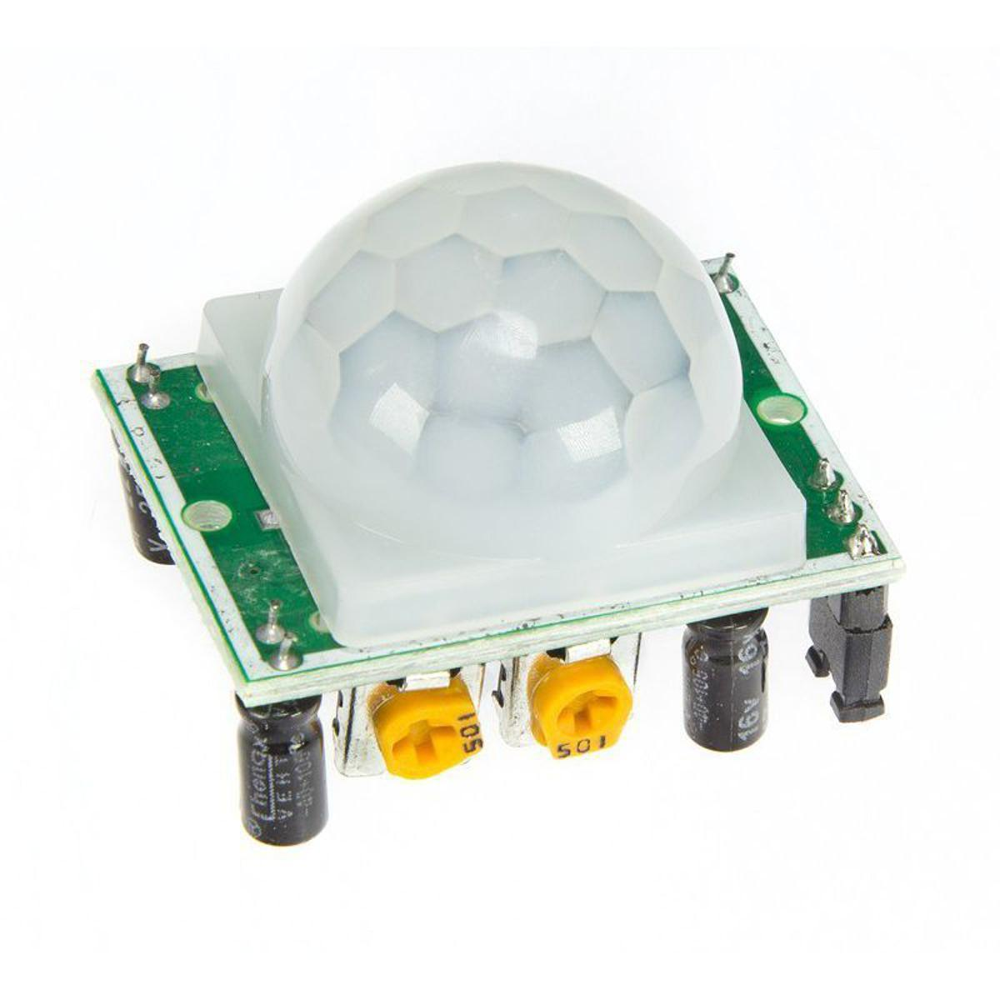

### 5.5 Gas Sensors
Gas sensors detect harmful or specific gases in the environment. They play a major role in safety and industrial monitoring systems.

**Examples:** MQ-2, MQ-135

**Applications:**
- Air Quality Monitoring
- Gas Leakage Detection
- Industrial Safety Systems

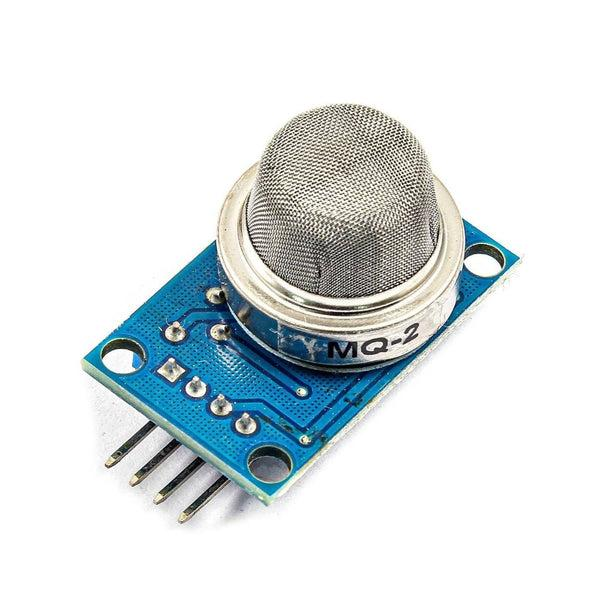

### 5.6 Pressure Sensors
Pressure sensors measure force applied per unit area. They are used in industrial systems, automotive applications, and weather stations.

**Applications:**
- Tire Pressure Monitoring
- Weather Forecasting
- Industrial Automation

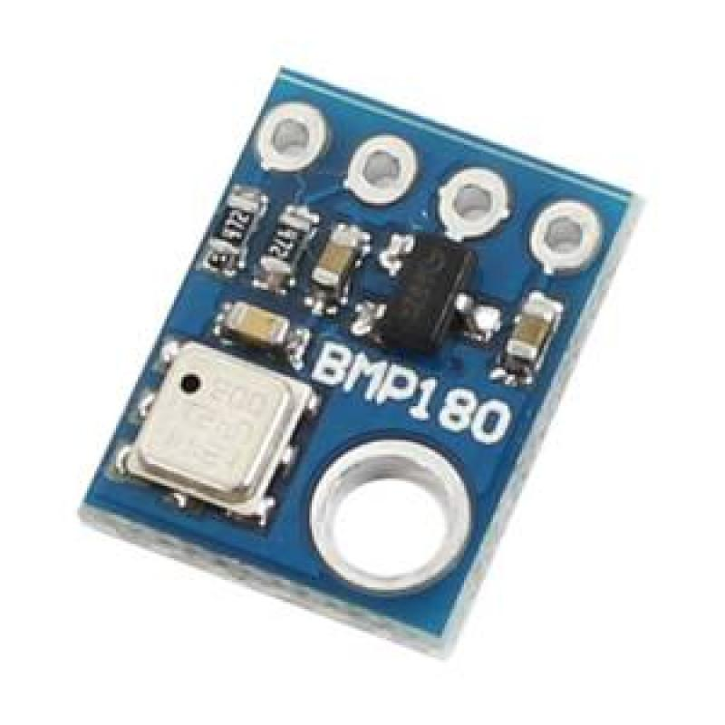

### 5.7 Proximity Sensors
Proximity sensors detect nearby objects without physical contact. They are commonly used in robotics and smartphones.

**Types:**
- Ultrasonic Sensors
- Infrared Sensors

**Applications:**
- Obstacle Detection
- Robot Navigation
- Smartphone Auto Screen-Off

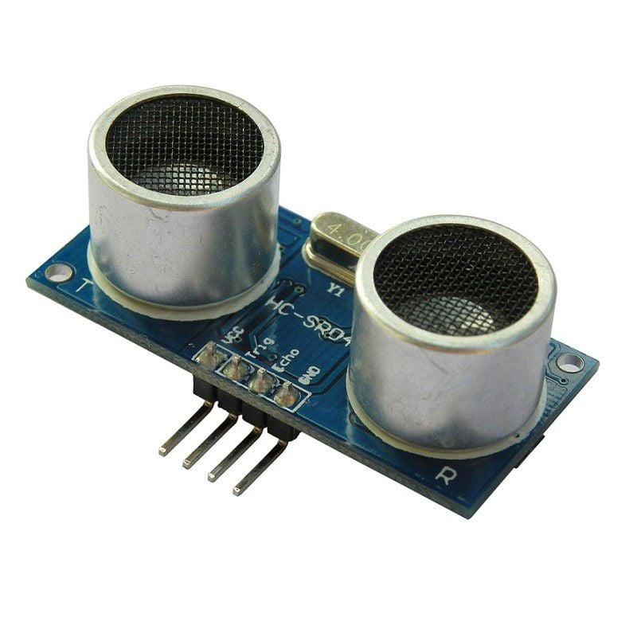

## 6. Working Principle of IoT Sensors
IoT sensors operate by detecting physical changes and converting them into electrical signals. These signals are processed by microcontrollers and transmitted to IoT platforms for monitoring and decision-making.

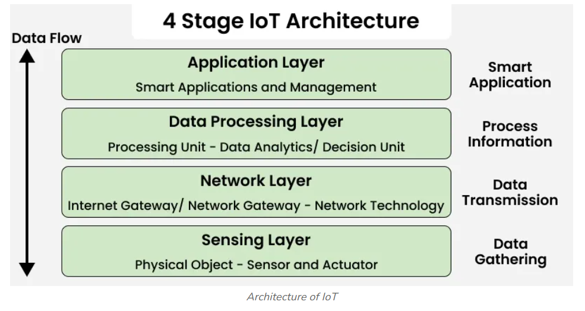

## 7. Importance of IoT Sensors
- Enable real-time monitoring of environments.
- Support automation in smart systems.
- Improve decision-making through data collection.
- Form the foundation of all IoT applications.

## 8. Applications of IoT Sensors

**Smart Homes**
- Smart Lighting
- Temperature Control
- Security Systems

**Healthcare**
- Patient Monitoring
- Wearable Devices

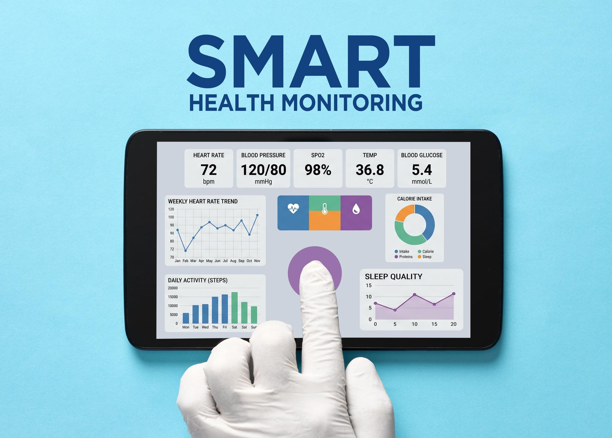

**Smart Agriculture**
- Soil Monitoring
- Weather Monitoring
- Automated Irrigation

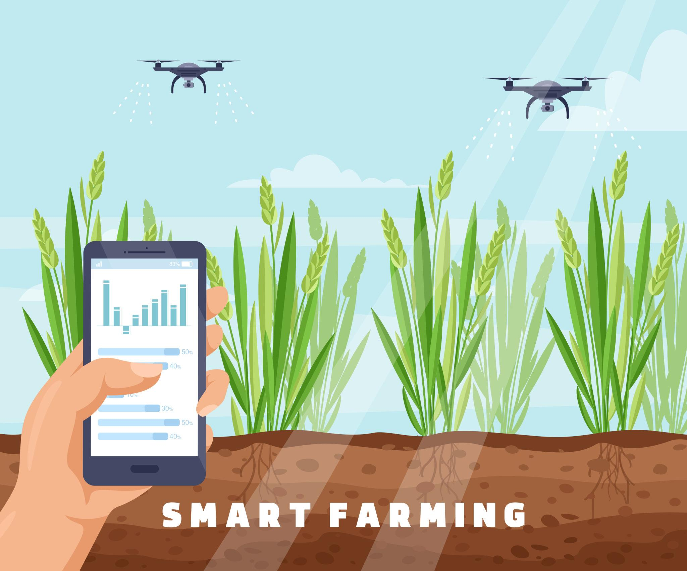

**Industrial Automation**
- Predictive Maintenance
- Equipment Monitoring

**Smart Cities**
- Traffic Management
- Environmental Monitoring
- Smart Parking

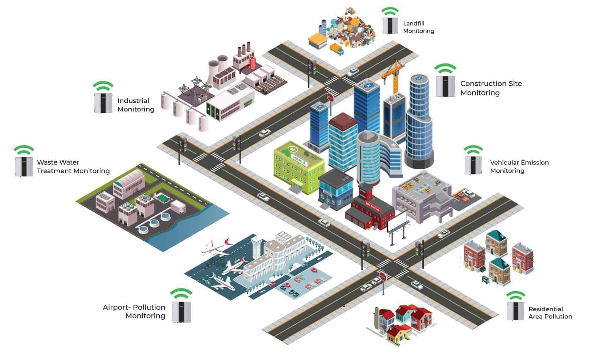
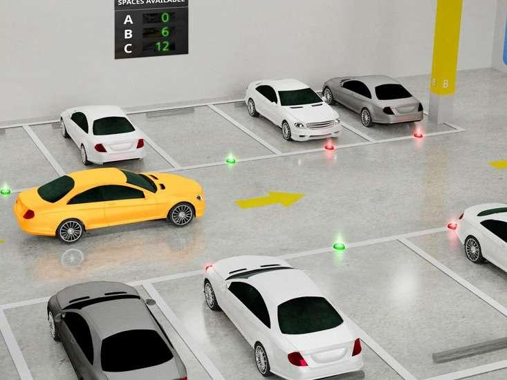

## 9. Procedure (Theoretical Study)
1. Studied different IoT sensors from academic sources.
2. Understood the working principles of each sensor type.
3. Analyzed real-world applications.
4. Classified sensors based on physical parameters and functions.
5. Prepared summarized notes for each sensor type.

## 10. Output
- Clear understanding of IoT sensor types.
- Knowledge of classification methods.
- Awareness of real-world applications.
- Ability to distinguish sensor functions.

## 11. Conclusion
In this lab, we studied different types of IoT sensors and their roles in real-world systems. Each sensor plays a critical role in collecting environmental data such as temperature, humidity, motion, light, gas levels, and pressure.

These sensors form the **backbone of IoT systems** by enabling real-time monitoring, automation, and intelligent decision-making in applications such as smart homes, healthcare, agriculture, and industrial systems.