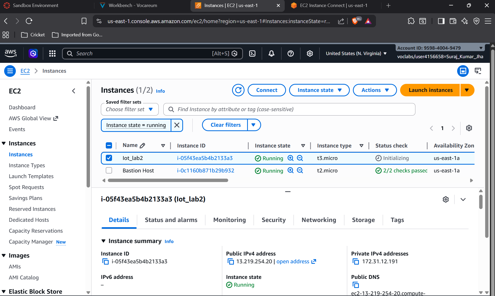
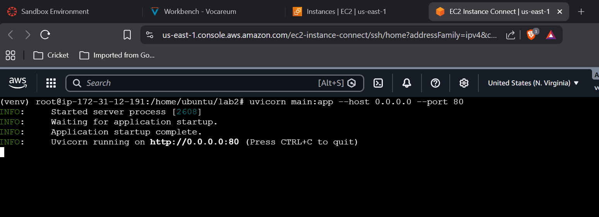

# Lab 2: Developing and Deploying a REST API to Store Data on Cloud

## Objectives

1. Launch and configure an AWS EC2 instance  
2. Create a Python virtual environment (venv)  
3. Install FastAPI, Uvicorn, and TinyDB  
4. Develop REST API endpoints using FastAPI  
5. Store temperature and humidity data with timestamps  
6. Test GET and POST API endpoints  

---

# Background Theory

## Cloud Computing in IoT Systems

Cloud computing allows IoT devices to store, process, and access data over the internet instead of relying only on local storage. It provides scalability, reliability, and remote accessibility for IoT applications.

## AWS EC2 (Elastic Compute Cloud)

AWS EC2 is a cloud service provided by Amazon Web Services that allows users to create virtual servers in the cloud. It enables developers to deploy applications remotely and manage computing resources efficiently.

## REST API Architecture

REST (Representational State Transfer) API is a communication architecture that allows different applications to exchange data using HTTP methods such as GET, POST, PUT, and DELETE.

## FastAPI Framework

FastAPI is a modern Python web framework used for building APIs quickly and efficiently. It provides high performance and automatic API documentation.

## TinyDB Database

TinyDB is a lightweight document-oriented database written in Python. It stores data in JSON format and is suitable for small applications and IoT projects.

## HTTP GET and POST Methods

- **GET Method:** Used to retrieve data from the server.  
- **POST Method:** Used to send data to the server for storage or processing.  

---

# Procedure

## Step 1: Launch AWS EC2 Instance

1. Login to AWS Console.
2. Open EC2 Dashboard.
3. Launch a new Ubuntu instance.
4. Configure security groups and allow HTTP and SSH access.
5. Connect to the EC2 instance using SSH.

### Screenshot of EC2 Instance



---

## Step 2: Create Python Virtual Environment

Run the following commands:

```bash
sudo apt update
sudo apt install python3-pip python3-venv -y

python3 -m venv myenv
source myenv/bin/activate
```

### Screenshot of Virtual Environment Setup



---

## Step 3: Install Required Packages

```bash
pip install fastapi uvicorn tinydb
```

---

## Step 4: Create FastAPI Application

Create a file named `main.py`.

```python
from fastapi import FastAPI
from tinydb import TinyDB
from datetime import datetime

app = FastAPI()

db = TinyDB('iot_data.json')

@app.get("/")
def home():
    return {"message": "IoT REST API Running"}

@app.post("/data")
def store_data(temperature: float, humidity: float):
    data = {
        "temperature": temperature,
        "humidity": humidity,
        "timestamp": str(datetime.now())
    }

    db.insert(data)

    return {
        "message": "Data stored successfully",
        "data": data
    }

@app.get("/data")
def get_data():
    return db.all()
```

---

## Step 5: Run the FastAPI Server

```bash
uvicorn main:app --host 0.0.0.0 --port 80
```

---

## Video Demonstration

Click the image below to watch the deployment and testing process.

[](https://youtu.be/3FhiXLByrKo)
---

## Data stored on server in json format


---

# Output

- AWS EC2 instance was successfully launched.
- FastAPI application was deployed on the cloud server.
- Temperature and humidity data were stored using TinyDB.
- GET and POST endpoints worked successfully.
- API was tested through browser and Swagger UI.

---

# Conclusion

In this lab, a REST API was successfully developed and deployed on an AWS EC2 cloud server using FastAPI. TinyDB was used to store IoT sensor data such as temperature and humidity along with timestamps. The API endpoints were tested successfully using GET and POST methods. This experiment demonstrated the practical implementation of cloud computing and REST API concepts in IoT systems.
